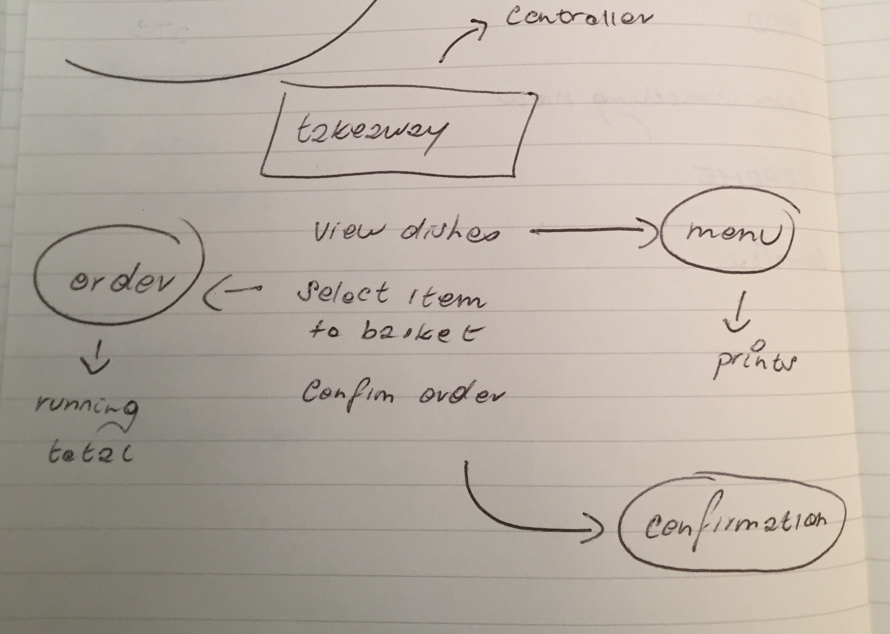

# Takeaway Challenge Revisited

Simple console application that interacts with the user on the command line. The
user will view the takeaway menu and add items to their basket before submitting
an order.

## Installation

`git clone git@github.com:telgi/takeaway-challenge-revisited.git`

Run `bundle` to download any gem dependencies

## Usage

Run `ruby app.rb` in the command line to launch the application

## User Stories

```
As a customer,
So that I can check if I want to order something,
I would like to see a list of dishes with prices.

As a customer,
So that I can order the meal I want,
I would like to be able to select some number of several available dishes.

As a customer,
So that I can verify that my order is correct,
I would like to check that the total I have been given matches the sum of the various dishes in my order.

As a customer,
So that I am reassured that my order will be delivered on time,
I would like to receive a text such as "Thank you! Your order was placed and will be delivered before 18:52" after I have ordered.
```

## Features

* User can view all dishes and their prices [x]
* User can select an item and add it to their basket [x]
* User can view the current basket and the running total [x]
* User will receive a confirmation message of when their order will arrive []

## Domain Model



## Process

1) Establish core features via user stories
2) Diagram how Ruby objects will interact with each other
3) Establish connectivity to console by launching `Takeaway.rb` from `app.rb` in the root
4) `Takeaway` will be the only object that directly interacts with the user
5) User will have options available for navigation - one of which is seeing the menu
6) `Menu` will be a new object that has the single responsibility of displaying each item and the corresponding price
7) The user is currently stuck in an infinite loop so we need to add the ability to quit
8) Now that the user can view the menu, an `Order` object will allow the user to select items that get added to a basket
9) Make sure that only items from the menu can be added to the basket
10) After accidentally adding a specific item where I should have typed 'add', I discovered that this caused the app to exit. We now need else clauses in both sets of user options to prevent this
11) Add more options for user to easily navigate around app, such as exiting, going back to home, and resetting order
12) As a sanity check, we want to see that when the user adds an item, the item has actually been added to their basket. This means we want functionality to display the basket
13) Now that the user can see their added items are being recorded in their basket, we need to add functionality for accumulating the running total and present this back to the user
14) To complete the 3rd feature, viewing the current order needs to be able to add all items together and sum the overall price for the user
15) Cover edge case of user trying to view an empty basket
